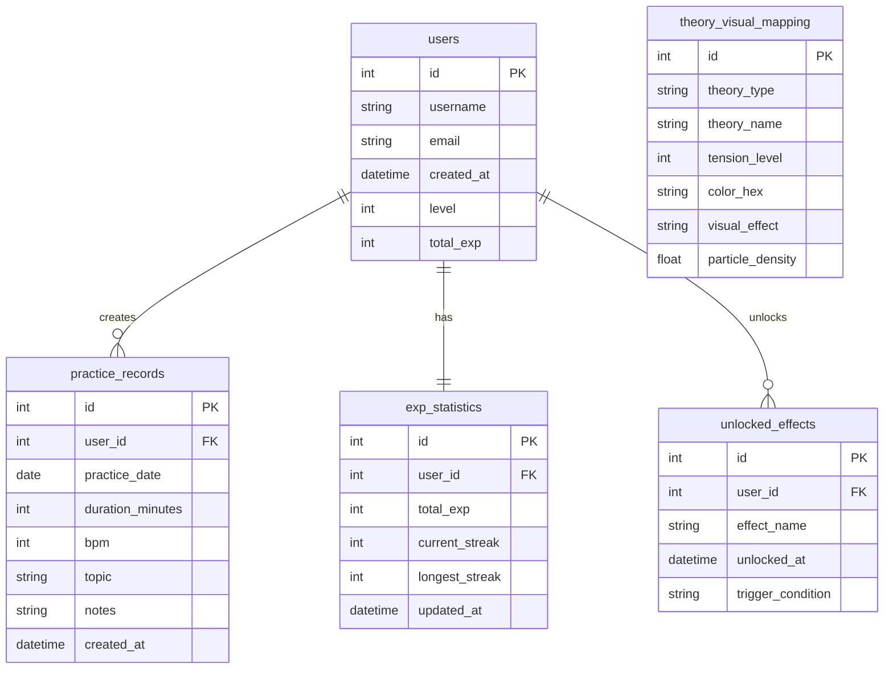

# Database ER Design

The database supports practice growth, unlockable visual effects, and theory-to-visual mappings. The first implementation targets SQLite for local development and keeps a path open for PostgreSQL.

## Entity Relationship Diagram

## Table Notes

### users

Stores profile and aggregate progression state. `total_exp` is duplicated from `exp_statistics` intentionally for fast profile reads; service logic must keep it synchronized.

### practice_records

Stores each practice session. `topic` is the bridge between practice and later skill tree or visual unlock logic.

### exp_statistics

Stores derived growth state for a user, including streaks. Streak calculations must be tested across month, leap-year, and year boundaries.

### theory_visual_mapping

Stores the default mapping between a music theory element and visual parameters. This table gives the visual engine database-backed defaults while keeping live render logic modular.

### unlocked_effects

Stores persistent visual capabilities unlocked through practice. These records alter sandbox rendering power over time.
